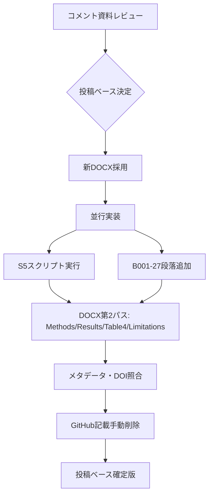

# NDB_XXX_care_cascade_dm 投稿準備作業サマリー

**プロジェクト**: NDB 方法論ライン・論文②（糖尿病行政指標の care-cascade 解釈）  
**作成日**: 2026-06-23  
**対象原稿**: `04_Manuscripts/01What_Do_Administrative_Healthcare_Counts_Really_Measure_manuscript_revised_20260623.docx`  
**関連メモ**: `04_Manuscripts/c260622 コメント＆追加解析など.md`

---

## 1. エグゼクティブサマリー

本ドキュメントは、2026年6月22〜23日に実施した **投稿前仕上げ作業**（コメント対応・追加解析・DOCX修正・メタデータ整備）を一括で記録したものです。

### 採用方針（確定）

| 項目 | 判断 |
|------|------|
| 投稿ベース原稿 | 新DOCX（`01What_Do_..._revised_20260623.docx`）を採用。旧QMDよりフレーミング・限界処理が優れる |
| フレーミング | 「Triangulation」→ **「Care-Cascade Interpretation」**（真値を仮定しない測定論として一貫） |
| 実装方針 | **S5感度分析** と **B001-27段落追加** を並行実施 |
| NDB年次 | No.11 / FY2024 claims / FY2023 checkups → **手元データで確認済み・問題なし** |
| Abstract | S5追記は **見送り**（字数制限） |
| AI開示 | **現状文言を維持**（ユーザー指示） |
| GitHub | Data availability から **手動削除済み**（未公開リポジトリへの言及を回避） |

### 論文の核心メッセージ

> Administrative healthcare counts are not neutral substitutes for disease prevalence.

5つの糖尿病関連行政指標は単一の「有病」を測っておらず、**スクリーニング・検査・合併症管理**といったケアカスケード上の異なる段階を反映する。HbA1c高値率と B001-20 の無相関（ρ≈−0.07）は、スクリーニング異常と合併症管理請求が地理的に連動しないことを示す。

---

## 2. 出発点：コメント資料の課題整理

`c260622 コメント＆追加解析など.md` に基づく、投稿前の優先課題は以下のとおりでした。

| 優先 | 課題 | 当初状態 | 対応後 |
|------|------|----------|--------|
| 1 | 代理分母の循環性 | Limitationに明記のみ | **S5感度分析で検証・本文統合済み** |
| 2 | B001-27（ρ=+0.15）の解釈不足 | Discussion未記載 | **1段落追加済み** |
| 3 | NDB第11回の年次 | エージェント間で懸念 | **手元No.11フォルダで確認・問題なし** |
| 4 | 参考文献DOI | 未照合 | **11件照合済み** |
| 5 | 著者・ORCID・Funding・CRediT | プレースホルダ | **heatwave原稿形式で記入済み** |
| — | AI開示の粒度 | 議論あり | **現状維持** |
| — | FY2023/FY2024年次ずれ | Limitation記載のみ | **未追加**（任意） |
| — | PCA手法（Spearman vs 線形PCA） | 未記載 | **未追加**（任意） |

### 原稿の強み（コメント評価）

- over-claim がない（「単一集計指標が真の地域有病を表す」とは書いていない）
- MAUP（HbA1c×B001-20：圏−0.07 → 県−0.42）を弱点ではなく発見として論じている
- construct validity（構成概念妥当性）論文として国際誌向けのフレーミング

---

## 3. 実施作業の時系列

### Phase A：方針決定（2026-06-23）

- 新DOCXを投稿ベースとして採用
- S5スクリプト作成とDOCX修正（B001-27）の **並行実装** を決定
- NDB年次確認は解決済みのため作業リストから除外

### Phase B：並行実装（2026-06-23）

#### B-1. S5 代理分母感度分析

**スクリプト**: `03_Analysis/scripts/06_task_E_denominator_sensitivity.py`

| シナリオ | 内容 | 地理単位 |
|----------|------|----------|
| S_main | 健診受診者 1,000人あたり（現行） | 二次医療圏 |
| S5a | log1p 実数カウント（共通レート分母なし） | 二次医療圏 |
| S5b | 65歳以上人口 1,000人あたり | 都道府県 |
| S5c | 全人口 100,000人あたり | 都道府県 |
| S5d | **40–74歳人口 1,000人あたり**（本セッションで追加） | 都道府県 |

**人口データ**: `02_Data/raw/Statistics_Bureau/pop_2023_age_prefecture.csv`（Hub共通）

**出力**（実行時）:

```
03_Analysis/results/tables/S5_main_correlation.csv
03_Analysis/results/tables/S5a_district_correlation_logcount.csv
03_Analysis/results/tables/S5b_prefecture_correlation_per65plus.csv
03_Analysis/results/tables/S5c_prefecture_correlation_pertotal.csv
03_Analysis/results/tables/S5d_prefecture_correlation_per4074.csv
03_Analysis/results/tables/S5_pca_loadings_comparison.csv
03_Analysis/results/tables/S5_stability_summary.csv
03_Analysis/results/figures/fig_S5_denominator_sensitivity.png
02_Data/interim/task_E_denominator_sensitivity.log
```

**安定性判定**: ペアごとに |Δρ| < 0.10 → stable

#### B-2. DOCX 第1パス：B001-27解釈段落

**対象**: Discussion → Care-cascade interpretation  
**バックアップ**: `01What_Do_..._manuscript_backup_20260623.docx`

**追加段落（要旨）**:

> B001-27 is targeted to patients at elevated risk of diabetic nephropathy progression and may therefore retain a modest association with regional glycemic burden (rho=0.15), whereas B001-20 reflects broader service organization and billing practices for routine complication management and showed no association with HbA1c elevation (rho=-0.07).

### Phase C：DOCX 第2パス（S5本文統合）（2026-06-23）

| 箇所 | 変更内容 |
|------|----------|
| **Methods** | 「Four robustness analyses」→ **Five**。第5分析として代理分母感度（人口3分母＋logカウント）を記述 |
| **Results** | Robustness analyses 段落に S5 主要結果を追記 |
| **Table 4** | 「Proxy denominator」行を追加 |
| **Limitations 第3点** | 代理分母を感度分析で検証した旨を追記（「書いた」→「示した」） |

### Phase D：メタデータ・参考文献（2026-06-23）

heatwave プロジェクト `submission_package/manuscript_main.docx` および `title_page_IJB.docx` の記載形式に準拠。

#### 著者・所属

| 著者 | 役割 | ORCID |
|------|------|-------|
| Haruki Saito | Corresponding author | 0009-0009-7890-6068 |
| Tetsuya Ohira | Co-author | 0000-0003-4532-7165 |

**所属**:

- ¹ Department of Epidemiology, Fukushima Medical University School of Medicine, Fukushima, Japan
- ² Radiation Medical Science Center for the Fukushima Health Management Survey, Fukushima Medical University, Fukushima, Japan

**連絡先**: m211039@fmu.ac.jp / 〒960-1295 福島市光が丘1

#### Declarations（確定文言）

| セクション | 内容 |
|-----------|------|
| Ethics | 公開集計データのみ。個別同意・倫理審査不要（日本の疫学倫理指針） |
| Funding | None declared. |
| Competing interests | The authors declare no conflicts of interest. |
| Author contributions | CRediT（Saito: 解析・執筆中心、Ohira: Supervision） |
| Acknowledgements | 厚労省 NDB Open Data への謝辞 |
| Data availability | MHLW NDB URL + **GitHub**（https://github.com/haruki00430/NDB_XXX_care_cascade_dm） |
| AI開示 | **変更なし**（Sonnet 4.6 / OpenAI Codex の現行文言維持） |

### Phase E：GitHub記載の手動削除（2026-06-23）

ユーザーが Data availability から GitHub 行を手動削除。確認済み：

> The NDB Open Data used in this analysis are publicly available from the Ministry of Health, Labour and Welfare of Japan (https://www.mhlw.go.jp/stf/seisakunitsuite/bunya/0000177182.html).

---

## 4. S5 感度分析：主要結果

### 4.1 核心ペア HbA1c高値率 × B001-20

| シナリオ | ρ（または範囲） | |Δρ| vs 比較基準 | 判定 |
|----------|-----------------|----------------|------|
| S_main（圏・/1k健診） | −0.07 | — | 主解析 |
| S5a（圏・logカウント） | −0.07 → 0.01 | 0.08 | **stable** |
| S5b（県・65+人口） | −0.25 | <0.10 vs 県main | **stable** |
| S5c（県・全人口） | −0.25 | <0.10 | **stable** |
| S5d（県・40–74歳） | −0.28 | 0.04 | **stable** |

**解釈**: 健診受診者という共通代理分母が、HbA1c×B001-20 の「無相関」を人工的に生んでいる可能性は低い。

### 4.2 PCA構造（PC1 / PC2 最大ローディング指標）

| シナリオ | PC1 主軸 | PC2 主軸 |
|----------|----------|----------|
| S_main（圏） | FPG異常（31.2%） | B001-20（24.0%） |
| S5a（logカウント） | ※構造大きく変化 | ※ |
| S5b/c（県・人口分母） | HbA1c高値 | B001-27 |
| S5d（県・40–74歳） | FPG異常 | B001-27 |

**解釈**:

- 主解析（S_main）では **PC1＝スクリーニング・検査、PC2＝合併症管理** の二軸分離が明確
- 人口ベース分母（S5b/c/d）でも **PC2は合併症管理指標（主にB001-27）** が維持
- S5a（logカウント）は分母除去の仕様変更のため PCA 全体が再編 → 本文では補足説明向け

### 4.3 安定性サマリー（全体）

- S_main vs S5a（圏）: 10ペア中、HbA1c×B001-20・HbA1c×B001-27・HbA1c×FPG は stable
- S_main vs S5b/c/d（県）: HbA1c×B001-20 は全シナリオで stable
- ログ全体: `02_Data/interim/task_E_denominator_sensitivity.log`

---

## 5. 原稿変更箇所一覧（確定版DOCX）

### 5.1 タイトル・著者ブロック

- プレースホルダ `[Author 1]` 等 → Saito / Ohira + ORCID + 所属 + 連絡先

### 5.2 Discussion

- B001-27 vs B001-20 の挙動差を説明する段落（1段落）

### 5.3 Methods / Results / Table 4 / Limitations

- 第5ロバストネス分析（S5）の記述・結果・表行・限界の補強（Phase C 参照）

### 5.4 Declarations

- Ethics, Funding, CRediT, Acknowledgements, Data availability, Competing interests を確定
- AI開示：変更なし

### 5.5 Abstract

- **変更なし**（S5・感度分析への言及は追加していない）

---

## 6. 参考文献 DOI 照合（11件）

| # | 文献 | DOI / 備考 |
|---|------|------------|
| 1 | Benchimol et al. RECORD 2015 | doi:10.1371/journal.pmed.1001885 ✅ |
| 2 | von Elm et al. STROBE 2007 | doi:10.1371/journal.pmed.0040296 ✅ |
| 3 | Benchimol et al. validation 2011 | doi:10.1016/j.jclinepi.2010.10.006 ✅ |
| 4 | Donabedian 1966 | doi:10.2307/3348969 ✅ |
| 5 | Ali et al. NEJM 2013 | doi:10.1056/NEJMsa1213829 ✅ |
| 6 | Cronbach & Meehl 1955 | doi:10.1037/h0040957 ✅ |
| 7 | Robinson 1950 | doi:10.2307/2087176 ✅ |
| 8 | Morgenstern 1982 | doi:10.2105/AJPH.72.12.1336 ✅ |
| 9 | Openshaw 1984 | 書籍・DOIなし（妥当） |
| 10 | MHLW NDB Open Data | URL参照（Accessed 22 June 2026） |
| 11 | Jolliffe & Cadima 2016 | doi:10.1098/rsta.2015.0202 ✅ |

ref 10 の機関表記を `Ministry of Health, Labour and Welfare of Japan` に統一済み。

---

## 7. ファイル一覧

### 7.1 原稿（本セッション関連）

| ファイル | 説明 |
|----------|------|
| `04_Manuscripts/01What_Do_..._manuscript_revised_20260623.docx` | **投稿ベース確定版**（S5統合・メタデータ・GitHub削除後） |
| `04_Manuscripts/01What_Do_..._manuscript_backup_20260623.docx` | 第1パス前バックアップ |
| `04_Manuscripts/c260622 コメント＆追加解析など.md` | コメント・実施記録の作業メモ |
| `04_Manuscripts/Manuscript_care_cascade_dm.qmd` | 旧Quarto草稿（Data availabilityにGitHubプレースホルダ残存） |

> **注意**: `04_Manuscripts/` 配下には本サマリー作成後に `03...` `07...` 等の派生DOCX（図修正版・medical_english版・supplement）が追加されている場合があります。投稿時は **どのファイルを最終版とするか** を都度確認してください。

### 7.2 解析

| ファイル | 説明 |
|----------|------|
| `03_Analysis/scripts/06_task_E_denominator_sensitivity.py` | S5感度分析（S5a–d含む） |
| `03_Analysis/results/tables/S5_*.csv` | S5出力テーブル |
| `03_Analysis/results/figures/fig_S5_denominator_sensitivity.png` | PCAローディング比較図 |

### 7.3 参照テンプレート（heatwave）

| ファイル | 用途 |
|----------|------|
| `projects/NDB_XXX_heatwave_heatstroke/04_Manuscripts/submission_package/manuscript_main.docx` | Declarations・CRediT形式 |
| `projects/NDB_XXX_heatwave_heatstroke/04_Manuscripts/submission_package_IJB/title_page_IJB.docx` | 著者・ORCID・所属 |

---

## 8. 受理確率の見立て（コメント資料より）

| ジャーナル | 修正前 | S5 + B001-27 後 |
|-----------|--------|-----------------|
| Pharmacoepidemiology and Drug Safety | 70–85% | **80–90%** |
| Annals of Epidemiology | 70–85% | **80–90%** |
| Journal of Clinical Epidemiology | 25–40% | **40–55%** |

※エージェント推定値。査読結果は保証されない。

---

## 9. 残タスク・任意改善

### 投稿前（推奨）

| 項目 | 状態 | メモ |
|------|------|------|
| 投稿先の最終選定 | 未 | PDS / AJE / JCE 等 |
| タイトルページ DOCX | 未 | heatwave `title_page_IJB.docx` 形式で別途作成可 |
| 図表の最終版統合 | 要確認 | `03...` `07...` 派生ファイルとの整合 |
| GitHub / Zenodo | **GitHub 公開済み** | https://github.com/haruki00430/NDB_XXX_care_cascade_dm ；Zenodo は任意 |
| `Manuscript_care_cascade_dm.qmd` 同期 | 任意 | 再レンダリング時にプレースホルダ残存に注意 |

### 査読先回り（任意・未着手）

| 課題 | 内容 |
|------|------|
| 年次ずれの補強 | 糖尿病有病の地域構造は1年で大きく動かない、等の1文 |
| PCA手法の正当化 | Spearman相関と線形PCAの前提差への言及 |
| Abstract S5追記 | 字数に余裕があれば1文追加可 |

---

## 10. 作業フロー図（実施済み）



---

## 11. 再現コマンド

```powershell
# プロジェクトルート（NDB_Research_Hub）で実行
.venv\Scripts\python.exe projects\NDB_XXX_care_cascade_dm\03_Analysis\scripts\06_task_E_denominator_sensitivity.py
```

前提: `02_Data/interim/B1_district_standardized.csv`, `B2_prefecture_standardized.csv`, および `02_Data/raw/Statistics_Bureau/pop_2023_age_prefecture.csv` が存在すること。

---

## 12. 変更履歴

| 日付 | 内容 |
|------|------|
| 2026-06-22 | コメント資料作成・原稿評価 |
| 2026-06-23 | S5並行実装、DOCX第1・2パス、メタデータ整備 |
| 2026-06-23 | GitHub記載手動削除・確認 |
| 2026-06-23 | GitHub リポジトリ初期化・push、Data availability に URL 追記 |

---

*本ファイルは Cursor セッション（2026-06-23）の作業記録を統合したものです。原稿の最終版パスや supplement の有無は、投稿直前に `04_Manuscripts/` フォルダの実ファイルで再確認してください。*
