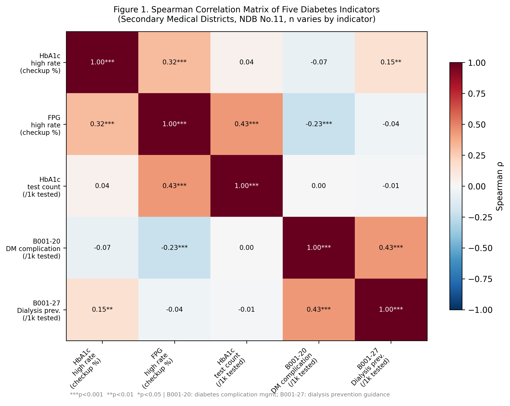
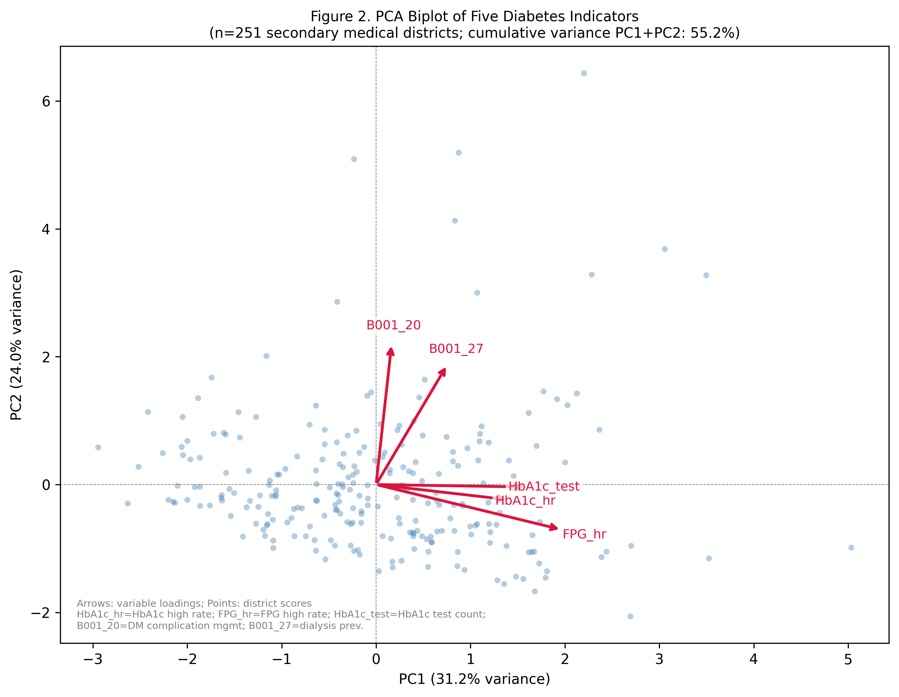
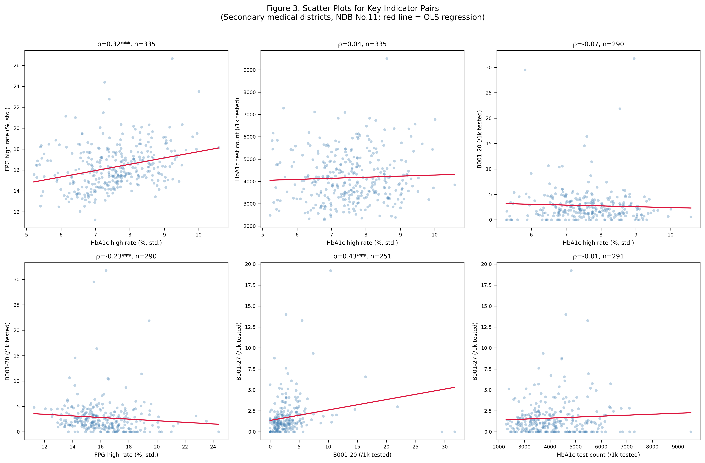
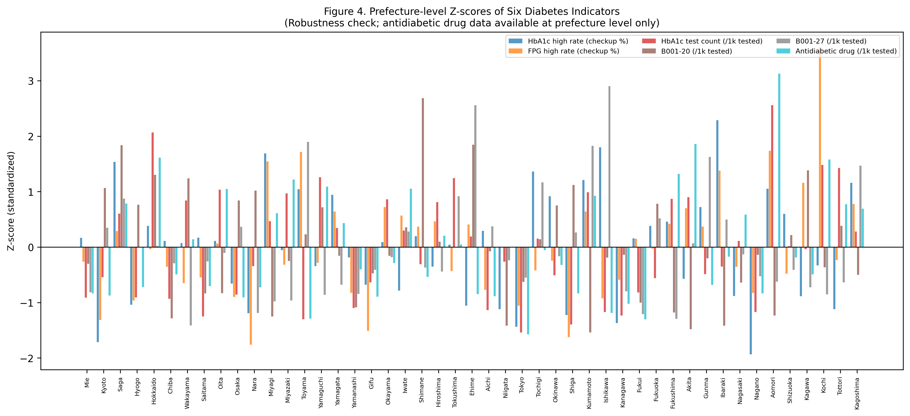
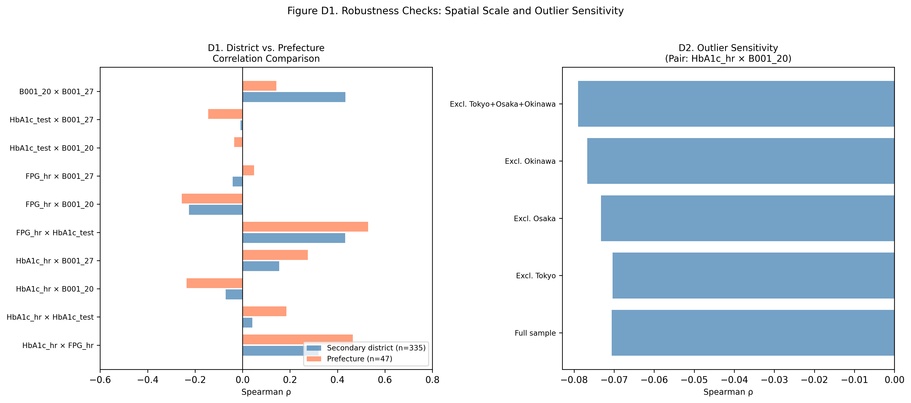

## Introduction

Administrative healthcare data have become a cornerstone of population health monitoring. In Japan, the National Database (NDB) Open Data—derived from universal health insurance claims—provides near-complete coverage of healthcare utilization across all 47 prefectures and approximately 335 secondary medical districts. These data include drug prescriptions, laboratory test counts, physician fee claims for specific management programs, and results from the mandatory Specific Health Checkup (tokutei kenshin) program targeting individuals aged 40–74 [@mhlw_ndb_opendata].

Diabetes mellitus (DM) is a leading cause of disability, dialysis, and cardiovascular mortality in Japan, affecting an estimated 10–12% of adults [@ncd_risk_2022]. Accordingly, several administrative indicators have been proposed as regional measures of DM burden: HbA1c-based screening rates from the Specific Health Checkup, antidiabetic drug prescription volumes, claims for diabetes complication management (B001-20), and counts of HbA1c laboratory tests ordered in clinical settings [@diabetes_action_plan_2021].

A fundamental but underexplored question is whether these indicators measure the same construct. Intuitively, regions with higher DM prevalence might be expected to have more prescriptions, more laboratory tests, and more specialist management visits. However, each indicator reflects a different point in the care cascade: screening identifies people at risk or undiagnosed; laboratory test counts reflect monitoring intensity; physician management codes reflect engagement in structured complication prevention; prescriptions reflect treatment uptake. Each step may be governed by different supply-side, policy, and sociodemographic factors.

Prior work has demonstrated that healthcare utilization indicators can diverge substantially across spatial units due to supply-side factors, access barriers, and differences in coding practices [@healthcare_access_japan]. No study has systematically compared the five major NDB-available DM indicators across Japan's secondary medical districts, the primary planning unit for regional health policy.

We therefore conducted a cross-sectional ecological study with three aims: (1) to quantify the pairwise correlations among five NDB-derived DM indicators across secondary medical districts; (2) to identify latent dimensions of DM-related healthcare activity using PCA; and (3) to assess the robustness of these relationships across spatial scales and after exclusion of atypical regions. Findings are intended to inform indicator selection in future epidemiological studies and provide a methodological guide for researchers using NDB data.

## Methods

### Study Design and Data Source

We conducted a cross-sectional ecological study using publicly available aggregate data from the NDB Open Data No. 11, released by the Ministry of Health, Labour and Welfare (MHLW) of Japan [@mhlw_ndb_opendata]. All data represent publicly available aggregate statistics; no individual-level data were accessed. Ethics review was not required under applicable Japanese regulations for analyses of anonymized aggregate public data.

The NDB Open Data comprises two data streams: (1) medical claims (diagnosed and billed diagnoses, procedures, prescriptions; FY2024 for No. 11) and (2) Specific Health Checkup results (FY2023 for No. 11). The one-year lag between claims and checkup data is inherent to the NDB release cycle and must be considered when interpreting joint analyses.

### Analysis Unit

The primary analysis unit was the secondary medical district (二次医療圏), the administrative unit used for regional health planning in Japan. As of the NDB No. 11 release, approximately 335 districts were identifiable. Districts were identified by a four-digit district code; names were used for labeling only and were not used as merge keys, as identical names (e.g., "Tobu", "Nishi") appear across multiple prefectures.

A prefecture-level robustness check (n=47) was performed in parallel. Antidiabetic drug prescription data were analyzed at the prefecture level only, as district-level prescription data are not included in the NDB Open Data (see Supplementary Table S1 for documentation).

### Indicators

Five indicators were included in the primary (district-level) analysis, and one additional indicator was used in the prefecture-level robustness check:

**Primary indicators (secondary medical districts and prefectures):**

1. *HbA1c high rate (checkup)* — Proportion of Specific Health Checkup participants with HbA1c ≥6.5% (sum of categories: ≥8.4%, 8.0–8.4%, and 6.5–8.0%), expressed as percentage of total tested.

2. *IFG high rate (checkup)* — Proportion of participants with fasting plasma glucose (FPG) ≥110 mg/dL (sum of categories: ≥126 mg/dL and 110–126 mg/dL), expressed as percentage of total tested.

3. *HbA1c test count (per 1,000 tested)* — Annual count of HbA1c laboratory tests (NDB procedure code 160010010) per 1,000 health checkup participants (proxy denominator; see Age Standardization).

4. *B001-20 patient count (per 1,000 tested)* — Annual patients receiving Diabetes Complication Management Fee (B001-20; 糖尿病合併症管理料) per 1,000 health checkup participants.

5. *B001-27 patient count (per 1,000 tested)* — Annual patients receiving Diabetes Dialysis Prevention Guidance Fee (B001-27; 糖尿病透析予防指導管理料) per 1,000 health checkup participants.

**Supplementary indicator (prefecture level only):**

6. *Antidiabetic drug quantity (per 1,000 tested)* — Total dispensed units of antidiabetic drug preparations (pharmacological class code 396) per 1,000 health checkup participants.

### Age Standardization

Checkup-based indicators (HbA1c high rate and IFG high rate) were directly age-standardized using the 2020 national census population aged 40–74 as the reference, with seven 5-year age groups (40–44, 45–49, 50–54, 55–59, 60–64, 65–69, 70–74). The NDB provides sex- and age-group-specific checkup participant counts, enabling direct standardization.

For claims-based indicators (HbA1c test counts, B001-20, B001-27), age-disaggregated counts at the district level are not available in the NDB Open Data. Direct standardization was therefore not applicable. Instead, each indicator was expressed per 1,000 health checkup participants (total, unadjusted) as a proxy denominator to account for district size variation. This approach assumes that checkup participation provides an approximate denominator for the eligible population. The potential confounding effect of the age structure on these rates was evaluated by examining correlations between PC scores and the proportion of older checkup participants (aged 65–74 as a proxy aging rate).

### Masking

NDB Open Data suppresses cells with fewer than 10 observations, replacing them with a dash ("−"). Such cells were treated as missing (NaN) and excluded from analyses. No imputation was performed. Masking rates were 13.4% for B001-20 and 13.1% for B001-27; HbA1c-based checkup indicators had 0% masking.

### Statistical Analysis

Pairwise Spearman rank correlations were computed for all indicator pairs, using all available non-missing observations for each pair (pairwise complete observations). PCA was performed on the complete case dataset (all five indicators non-missing, n=251 districts), after z-score standardization of each indicator. Three principal components were retained for examination, with axis interpretation aided by external correlation (PC scores against the proxy aging rate).

Robustness was assessed by: (1) comparing pairwise correlations between district-level and prefecture-level analyses; (2) sensitivity analyses excluding metropolitan (Tokyo, Osaka) and geographically atypical (Okinawa) districts; and (3) adding the antidiabetic drug prescription indicator at the prefecture level.

All analyses were conducted in Python 3.12 (pandas 2.x, scipy, scikit-learn). Random seed 42 was used where applicable. Code is available at [repository URL].

## Results

### Descriptive Statistics

After excluding records with the "district undetermined" designation and resolving duplicate district codes, 335 secondary medical districts were available (Table 1). Health checkup indicators were available for all districts; B001-20 and B001-27 had masking rates of 13.4% and 13.1%, respectively, with higher masking concentrated in rural prefectures.

Mean age-standardized HbA1c high rate (≥6.5%) was 7.55% (SD 1.23%, range 4.04–11.02%). Mean IFG rate (FPG ≥110 mg/dL) was 16.28% (SD 2.17%, range 10.35–24.16%). B001-20 (complication management) showed substantially greater variability than HbA1c high rate, with a coefficient of variation exceeding 90%, suggesting marked regional heterogeneity in clinical management uptake.

### Spearman Correlation Matrix

Pairwise Spearman correlations among the five indicators ranged widely (Table 2; Figure 1). The highest correlations were observed between FPG high rate and HbA1c test count (ρ=0.43, p<0.001) and between B001-20 and B001-27 (ρ=0.43, p<0.001). The HbA1c high rate from health checkups was modestly correlated with FPG high rate (ρ=0.32, p<0.001) but was essentially uncorrelated with B001-20 (ρ=−0.07, p=0.21) and HbA1c test count (ρ=0.04, p=0.47). IFG high rate showed a significant negative correlation with B001-20 (ρ=−0.23, p<0.001).

This pattern indicates that regions with high screening-detected abnormalities do not systematically exhibit higher use of structured complication-management programs, and vice versa.

### Principal Component Analysis

PCA on the 251 complete-case districts yielded three components with eigenvalues >1. PC1 explained 31.2% of variance and loaded most strongly on FPG high rate (loading 0.66), HbA1c test count (0.53), and HbA1c high rate (0.47), with minimal loading for B001-20 (0.06). This component was interpreted as "diagnostic and screening intensity." PC1 scores were positively correlated with the proxy aging rate (ρ=0.43, p<0.001), suggesting that older districts tend to have higher overall detection and monitoring activity.

PC2 explained 24.0% of variance and was dominated by B001-20 (loading 0.74) and B001-27 (loading 0.63), with weakly negative loadings for FPG high rate (−0.24) and HbA1c high rate (−0.08). This component was interpreted as "complication-management engagement," capturing the degree to which districts have organized systems for structured DM complication prevention. PC2 scores were negatively correlated with the proxy aging rate (ρ=−0.30, p<0.001), suggesting that districts with a younger tested population paradoxically have higher complication-management engagement—potentially reflecting better-resourced urban healthcare systems.

Together, PC1 and PC2 explained 55.2% of total variance, with PC3 adding a further 20.4%, suggesting that the five indicators do not collapse onto a single dimension of "DM burden" (Figure 2).

### Robustness and Sensitivity Analyses

**Spatial scale (D1):** When analyses were repeated at the prefecture level (n=47), 8 of 10 indicator pairs showed |Δρ|<0.15, suggesting that the correlation structure was broadly preserved across scales. Two pairs showed larger discrepancies: HbA1c high rate × B001-20 (district ρ=−0.07 vs. prefecture ρ=−0.42) and FPG high rate × B001-20 (district ρ=−0.23 vs. prefecture ρ=−0.42), indicating potential ecological aggregation effects (MAUP) for indicators spanning the screening-management gap.

**Outlier exclusion (D2):** For three of four key indicator pairs (HbA1c×FPG, B001-20×B001-27, FPG×HbA1c test), correlations remained statistically significant across all five exclusion scenarios (5/5). For HbA1c high rate × B001-20, the null correlation (ρ≈−0.07) was consistently non-significant across all scenarios (0/5), confirming that the divergence between screening and complication management is a genuine feature of the data, not driven by any single region.

**Prescription indicator (D3, prefecture level):** Antidiabetic drug quantity was highly correlated with HbA1c test count (ρ=0.87, p<0.001) and moderately with FPG high rate (ρ=0.53, p<0.001), but was not significantly correlated with B001-20 (ρ=−0.20, p=0.18) or B001-27 (ρ=−0.14, p=0.34). This reinforces the finding that prescription-based and claims-based management indicators capture distinct processes.

## Discussion

### Principal Findings

Using NDB Open Data across 335 secondary medical districts, we demonstrate that five commonly used administrative DM indicators represent at least two distinct latent dimensions: a "diagnostic intensity" dimension reflecting the detection and monitoring of glycemic abnormalities in the community, and a "complication-management engagement" dimension reflecting structured physician-led DM complication prevention programs.

The near-zero correlation between HbA1c high rate (a screening-based prevalence proxy) and B001-20 patient counts (a claims-based management proxy) is particularly striking. Policymakers who select only one of these indicators may reach opposite conclusions about regional DM burden. A region with high screening HbA1c prevalence and low B001-20 uptake may be underserving its high-risk population; conversely, a region with high B001-20 uptake but low screening prevalence may have good organized care for diagnosed patients but miss undiagnosed cases.

### Interpretation of PC Structure

The two-component structure aligns with the theoretical distinction between population-level disease detection (driven by screening programs, laboratory ordering patterns, and patient-initiated contact) and health-system-level organized care delivery (driven by specialist availability, diabetes educator programs, and reimbursement incentives). The negative PC2 correlation with proxy aging rate suggests that urban, resource-rich districts are better organized for complication management, potentially reflecting the concentration of diabetes specialists and outpatient DM clinics in metropolitan areas—a supply-side phenomenon rather than higher underlying DM prevalence.

### Indicator Selection Guide

Based on our findings, we suggest the following framework for indicator selection in future NDB-based studies:

| Research Question | Recommended Indicator(s) |
|---|---|
| Undiagnosed diabetes / screening burden | HbA1c high rate (checkup), FPG high rate |
| Laboratory monitoring intensity | HbA1c test count (/1,000 tested) |
| Complication risk management | B001-20, B001-27 |
| Treatment uptake (regional) | Antidiabetic drug quantity (prefecture level only) |
| Overall DM burden (multi-dimensional) | Triangulation using ≥2 indicators from different dimensions |

### Limitations

Several limitations deserve mention. First, this is an ecological study using aggregate data; individual-level inferences cannot be drawn (ecological fallacy). Second, the proxy denominator (health checkup participants) for clinical indicators may introduce bias if checkup participation rates differ systematically across districts. Third, direct age standardization was possible only for checkup-based indicators; clinical indicators were expressed as rates per checkup participants and may still reflect residual age confounding. Fourth, the one-year lag between claims (FY2024) and checkup (FY2023) data may introduce temporal misalignment. Fifth, NDB cell suppression (masking rate 13–14% for B001-20 and B001-27) may reduce statistical power for rural districts and may introduce selection bias if missingness is not random. Sixth, the modifiable areal unit problem (MAUP) may affect results; while our robustness analyses showed broadly consistent correlation structures across scales, two indicator pairs showed notable scale dependence. Seventh, prescription data were available only at the prefecture level, limiting comparability with the district-level primary analysis.

### Conclusions

Administrative DM indicators in Japan's NDB capture partially non-overlapping facets of the DM care continuum. The low or negative correlations between screening-based and claims-based management indicators challenge the assumption of indicator interchangeability. We recommend that researchers explicitly define which dimension of DM activity they intend to measure before selecting NDB-derived indicators, and that policy reports triangulate findings across multiple indicator types to obtain a more complete picture of regional DM burden.

## Acknowledgments

The authors thank the Ministry of Health, Labour and Welfare of Japan for providing access to the NDB Open Data. All data used are publicly available aggregate statistics.

## Ethics Statement

This study was conducted using anonymized, publicly available, aggregated NDB Open Data. No individual-level data were accessed. Ethical approval was not required under applicable Japanese regulations for analyses of anonymized aggregate public data.

## Conflicts of Interest

The authors declare no conflicts of interest.

## Data Availability

The NDB Open Data used in this analysis are publicly available from the Ministry of Health, Labour and Welfare of Japan (https://www.mhlw.go.jp/stf/seisakunitsuite/bunya/0000177182.html). The analysis code is openly available on GitHub (https://github.com/haruki00430/NDB_XXX_triangulation_dm).

## Funding

None declared.

## Author Contributions

[Author Name]: Conceptualization, Data curation, Formal analysis, Investigation, Methodology, Software, Visualization, Writing – original draft, Writing – review and editing.

[Supervisor Name]: Conceptualization, Supervision, Writing – review and editing.

## Declaration of Generative AI and AI-Assisted Technologies in the Manuscript Preparation Process

During the preparation and writing of this work, the authors used AI-assisted tools to support manuscript drafting and statistical analysis scripting. Cursor 3.0 (Anysphere) and Google Antigravity (Google) were used for AI-assisted writing and Python code development. Large language models used through these platforms included Claude Sonnet 4.6 and Claude Opus 4.8 (Anthropic) and GPT-5.5 (OpenAI) and Gemini 3 Pro (Google). These tools were used only for text drafting and code generation; no generative AI or AI-assisted tools were used to create, alter, or otherwise process any figures, images, or artwork in this manuscript. The authors reviewed and edited all AI-assisted outputs and were responsible for the study design, selection of statistical methods, interpretation of findings, conclusions, and final reference list. The authors take full responsibility for the integrity and accuracy of the final content. AI was not listed as an author.

## References

::: {#refs}
:::

## Tables

### Table 1. Data Sources and Descriptive Statistics

| Indicator | Source | Level | n valid | Mean | SD | Min | Max | Masking rate |
|---|---|---|---|---|---|---|---|---|
| HbA1c high rate (%, std.) | Checkup (FY2023) | District | 335 | 7.55 | 1.23 | 4.04 | 11.02 | 0% |
| FPG high rate (%, std.) | Checkup (FY2023) | District | 335 | 16.28 | 2.17 | 10.35 | 24.16 | 0% |
| HbA1c test count (/1k) | Claims (FY2024) | District | 335 | 4,167 | 2,156 | 320 | 15,248 | 0% |
| B001-20 (/1k tested) | Claims (FY2024) | District | 290 | 2.80 | 2.87 | 0.00 | 18.36 | 13.4% |
| B001-27 (/1k tested) | Claims (FY2024) | District | 291 | 1.65 | 2.04 | 0.00 | 14.00 | 13.1% |
| Antidiabetic drug (/1k) | Prescriptions (FY2024) | Prefecture only | 47 | — | — | — | — | 0% |

*Std. = directly age-standardized using 2020 national census, 40–74-year population. /1k = per 1,000 health checkup participants (proxy denominator).*

### Table 2. Spearman Correlation Matrix (Secondary Medical Districts, n=251–335)

| | HbA1c high rate | FPG high rate | HbA1c test | B001-20 | B001-27 |
|---|---|---|---|---|---|
| HbA1c high rate | 1.00 | 0.32*** | 0.04 | −0.07 | 0.15** |
| FPG high rate | | 1.00 | 0.43*** | −0.23*** | −0.04 |
| HbA1c test | | | 1.00 | 0.00 | −0.01 |
| B001-20 | | | | 1.00 | 0.43*** |
| B001-27 | | | | | 1.00 |

*Spearman ρ; ***p<0.001, **p<0.01, *p<0.05. Each cell uses pairwise complete observations.*

## Figures

**Figure 1.** Spearman rank correlation matrix of five diabetes-related NDB indicators across secondary medical districts (n=251–335 per pair). Numbers in cells are Spearman ρ; colour scale from −1 (blue) to +1 (red). Significance: \*\*\*p<0.001, \*\*p<0.01, \*p<0.05.

**Figure 2.** Principal component analysis biplot (PC1 vs. PC2, n=251 complete-case secondary medical districts). Arrows represent variable loadings; points represent individual districts. PC1 (31.2% variance) reflects "diagnostic and screening intensity"; PC2 (24.0% variance) reflects "complication-management engagement."

**Figure 3.** Scatter plots for six key indicator pairs across secondary medical districts. Lines indicate LOESS smoothers with 95% confidence bands. The near-zero correlation between HbA1c high rate and B001-20 (ρ=−0.07) is the central finding of this study.

## Supplementary Material

### Supplementary Table S1. Documentation of Prescription Data Exclusion from Primary Analysis

Antidiabetic drug prescription data (pharmacological class code 396, 糖尿病剤) are provided in the NDB Open Data No. 11 as prefecture-level aggregates only. A secondary-medical-district-level breakdown is not included in the NDB Open Data release (verified by inspection of all files in the "05_処方薬" folder). Therefore, prescription-based indicators were excluded from the primary analysis (n=335 districts) and used only as an additional indicator in the prefecture-level robustness check (n=47). This limitation is consistent with the NDB data publication policy and should be noted by researchers who require district-level prescription data.

### Supplementary Figure S1. Prefecture-Level Z-score Comparison (Six Indicators)

Standardized z-scores for all six indicators across 47 prefectures, ordered alphabetically. Diverging patterns between screening-dimension (PC1) and management-dimension (PC2) indicators confirm the multi-dimensional nature of regional diabetes burden.

### Supplementary Figure S2. Robustness Comparison (District vs. Prefecture Level)

Pairwise Spearman correlations at secondary medical district level (n=335) versus prefecture level (n=47) for all 10 indicator pairs. Eight of ten pairs show |Δρ|<0.15, indicating broadly preserved correlation structure across spatial scales.

